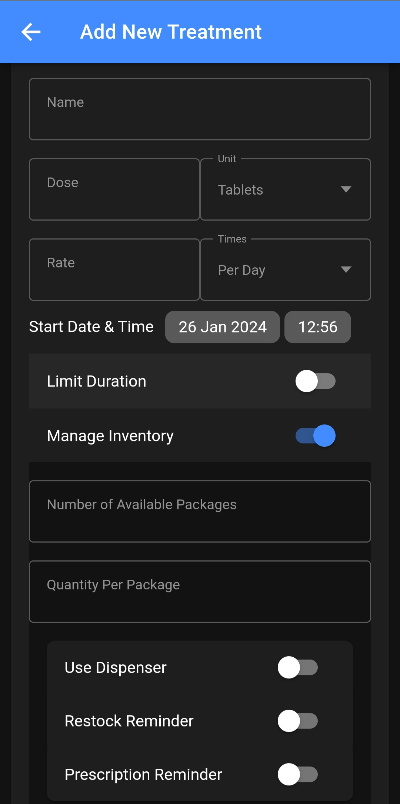

# Pillminder
Medication Tracker App and Dispenser.

# Introduction
In this project, our aim was to develop an inventive solution for monitoring and managing resources vital to an individual's well-being, with a specific focus on medications. Our initial market research highlighted areas for improvement in existing solutions.

We observed that available products in the market were either exclusively app-based or hardware-based. The existing dispensers were often proprietary, offering limited customization options, featuring bulky designs, and were not tailored to meet the needs of individual users.

To address these shortcomings, we chose a dual-component approach for our project: a smart pill dispenser and a companion mobile app designed for medication tracking. Our vision was to create a comprehensive product that could function both independently and in sync with each other. This design allowed users the flexibility to use the dispenser on its own or utilize the app solely as a medication reminder. By providing this dual functionality, our aim was to offer a flexible and user-friendly solution, catering to a diverse range of user preferences and needs.

## Videos

https://github.com/ahmad-aljabali/Pillwise/assets/36141448/cecf2776-79e3-4c20-b9d0-7685703d312a | https://github.com/ahmad-aljabali/Pillwise/assets/36141448/d999e439-b2e4-46c4-b8eb-4feb8e34578a
---|---


# Design

## Hardware
The aim was to create a simple and compact design that can be placed and used easily. The design incorporated a rotating plate capable of storing multiple medications, facilitating dispensing according to the prescription. To enhance user interaction, a visual display feature was integrated to notify users of medication times and provide instructions.

### 3D Modeling
The design process was accomplished by:

- Measure the dimensions of the main components so we can build a model that fits all the components and maintains a compact size. Precise measurements were obtained using a digital caliper.

- Using Autodesk Inventor Professional, we created detailed 3D models for each part of the prototype. This design process accounted for the dispenser's functionality, accommodating six types of medication on a rotating plate.


- The next step involved bringing our 3D models to life. We utilized a Prusa i3 MK3S+ FDM printer, with a slicing size set at 0.2-0.3 mm. The final printed dimensions of the prototype were 21 x 21 x 25 cm.


## Electronics
In this section, we will write in detail about the electronic components that are the core of our prototype. To achieve the goal of creating an automated prototype, we used an Arduino Uno microcontroller as the central processing unit. To establish a connection between the Arduino Uno and our mobile application, we integrated the ESP8266-01 Wi-Fi module. This module served as the communication bridge, enabling real-time interaction between the prototype and the user through the mobile app.

### Electronic Component:
- Arduino Uno
- ESP8266-01
- Servo motor
- Encoder 
- LCD 
- Wires 

After having every component , we started to verified the functionality of them before integrating into the overall electronic system.
The schematic of LCD with Arduino.


LED - 3.3v
SCK - 13
SDA - 11
DC - 9
Reset - 8
CS - 10
GND - GND
VCC - 5v [^1]

The schematic of ESP 8266-01 with Arduino.


GND-GND
VCC-3.3V
TX-3
RX-2
CH_PD-3.3V [^2]


The schematic of Servo Motor with Arduino.


GND-GND
VCC-5V
Control_Pin-9 [^3]

The schematic of Encoder with Arduino.


GND - GND
VCC - 5v
SW - 3
DT - 4
CLK - 5 [^4]


We only proceeded to integrate all components once we confirmed that each one was functioning as expected.

https://github.com/ahmad-aljabali/Pillwise/assets/36141448/dc6bbddc-dbca-42d1-aa9b-e82a9cc1dbc5

## Mobile App
### Architecture & Libraries
The app was develop with the goal of being usable as a standalone medicine tracking mobile app and/or in combination with the Dispenser.

Another design consideration was to use cross platform technologies, we settled in the end on using React single page PWA framework because of our prior familiarity with web development, this was used in combination with Ionic and Capacitor to add native app functionality.

For management of native functionality the following capacitor add-ons were utilized:
- Filesystem[^5]: for storing and reading user data locally 
- Local Notification[^6]: to provide push notification to user

For ease of development and quick modification the user data is stored in JSON format instead of using a dedicated database, saved in the standard native Android file structure.

### Layout
The app is split into three main screens, each displaying the following.
||||
---|---|---|---|---

**Today**
- Medication Name, Dose, Type
- Times to be taken today
- Slot if they're stored in Dispenser
- Allow user to Confirm or Skip medicine

**History**
- Status Record of Medication in previous days

**Prescriptions**
- Active Prescriptions
- Current stock value
- Button to add new prescription

Additionally the following screens are available.

**Add New Treatment**
- Form to Add New Medication
- Name, Dose, Type, Rate, Start Date & Time
- Inventory Info
- Prescription and Doctor Info

**Medicine Details**
- Can be accessed by clicking on Medication in Prescriptions Screen
- Shows complete medication info

## Building the App
To build the App from the available source code [^7] use the below instructions.

### Install Dependencies
```
npm install
```

### Run locally
```
ionic serve
```
### Build for android
```
ionic cap add android
ionic cap build android
```
**_Then build using android studio_**
**_Replace android with ios and use Xcode to build for ios_**

# Issues and Challanges
Our initial microcontroller choice was Raspberry Pi, because of its communication capabilities and the ease of hosting a local server.

Unfortunately, the Raspberry Pi unexpectedly ceased functioning, causing the need for an alternative solution. The simplest idea was to buy another Raspberry Pi, but out limited budget led us to look for a more affordable solution. Since most of us were familiar with Arduino Uno, we decided to use it as our microcontroller. 

We knew that Arduino Uno does not have built-in Wi-Fi, we solved this limitation by adding the ESP8266-01 module. This decision was influenced by the compact size of the ESP8266-01, which fit with the dimensions of our pre-existing 3D printed model. Despite the ESP8266-01's benefits, we faced some challenges due to its basic low level functionality, forcing us to use "_AT Commands_" instead of standard libraries. 

This method worked well, but it required alot of effort to handel and parse incoming command, due to lack of libraries to handel requests for this module.

# Conclusion & Future Works
Our project began with a basic idea: creating a prototype for a medical dispenser paired with a mobile app. We simultaneously worked on prototyping, 3D modeling, Arduino Uno code, and mobile app. Despite facing various challenges, we successfully integrated the dispenser prototype with the mobile app, simplifying medication tracking for users.

Looking ahead, the design may be improved by enhancing user-friendliness. This involves implementing a database of nearby pharmacies with specific medicines and introducing a scanning feature for users to easily input medication details into the app. These improvements will  provide users with a more intuitive and efficient medication management experience.

# References
[^1]: https://www.electronics-lab.com/project/using-st7735-1-8-color-tft-display-arduino/
[^2]: https://gndtovcc.home.blog/2020/02/11/code-for-obtaining-ip-address-from-esp-01/
[^3]: https://www.makerguides.com/servo-arduino-tutorial/
[^4]: https://www.diyengineers.com/2021/06/03/arduino-rotary-encoder-how-to-use/
[^5]: https://capacitorjs.com/docs/apis/filesystem
[^6]: https://capacitorjs.com/docs/apis/local-notifications
[^7]: https://github.com/ahmad-aljabali/Pillwise/tree/main/App%20src%20code
